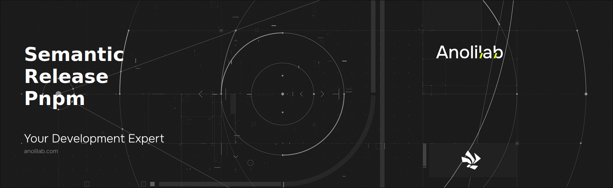

<!-- START_PACKAGE_OG_IMAGE_PLACEHOLDER -->

<a href="https://github.com/anolilab/semantic-release" align="center">

  

</a>

<h3 align="center">Semantic-release plugin to publish a npm package with pnpm.</h3>

<!-- END_PACKAGE_OG_IMAGE_PLACEHOLDER -->

<br />

<div align="center">

[![typescript-image][typescript-badge]][typescript-url]
[![mit licence][license-badge]][license]
[![npm downloads][npm-downloads-badge]][npm-downloads]
[![Chat][chat-badge]][chat]
[![PRs Welcome][prs-welcome-badge]][prs-welcome]

</div>

---

<div align="center">
    <p>
        <sup>
            Daniel Bannert's open source work is supported by the community on <a href="https://github.com/sponsors/prisis">GitHub Sponsors</a>
        </sup>
    </p>
</div>

---

## Install

```sh
npm install @anolilab/semantic-release-pnpm
```

```sh
yarn add @anolilab/semantic-release-pnpm
```

```sh
pnpm add @anolilab/semantic-release-pnpm
```

## Usage

The plugin can be configured in the [**semantic-release** configuration file](https://github.com/semantic-release/semantic-release/blob/master/docs/usage/configuration.md#configuration):

```json
{
    "plugins": ["@semantic-release/commit-analyzer", "@semantic-release/release-notes-generator", "@anolilab/semantic-release-pnpm"]
}
```

## Steps that are used

| Step               | Description                                                                                                                      |
| ------------------ | -------------------------------------------------------------------------------------------------------------------------------- |
| `verifyConditions` | Verify the presence of the `NPM_TOKEN` environment variable, or an `.npmrc` file, and verify the authentication method is valid. Results are cached per registry/auth combination to prevent throttling in monorepos. |
| `prepare`          | Update the `package.json` version and [create](https://docs.npmjs.com/cli/pack) the npm package tarball.                         |
| `addChannel`       | [Add a release to a dist-tag](https://docs.npmjs.com/cli/dist-tag).                                                              |
| `publish`          | [Publish the npm package](https://docs.npmjs.com/cli/publish) to the registry.                                                   |

## Configuration

### npm registry authentication

#### Official Registry

When publishing to the [official registry](https://registry.npmjs.org/), it is recommended to publish with authentication intended for automation:

- For improved security, and since access tokens have recently had their [maximum lifetimes restricted](https://github.blog/changelog/2025-09-29-strengthening-npm-security-important-changes-to-authentication-and-token-management/),
  [trusted publishing](https://docs.npmjs.com/trusted-publishers) is recommended when publishing from a [supported CI provider](https://docs.npmjs.com/trusted-publishers#supported-cicd-providers)
- [Granular access tokens](https://docs.npmjs.com/creating-and-viewing-access-tokens#creating-granular-access-tokens-on-the-website) are recommended when publishing from a CI provider that is not supported by npm for trusted publishing, and can be set via [environment variables](#environment-variables).
  Because these access tokens expire, rotation will need to be accounted for in this scenario.

> [!NOTE]
> When using trusted publishing, provenance attestations are automatically generated for your packages without requiring provenance to be explicitly enabled.

> [!IMPORTANT]
> **First-time releases with OIDC**: npm requires a package to exist before you can configure OIDC trusted publishing. If you're releasing a package for the first time with OIDC, you have two options:
>
> 1. Publish a dummy version manually first (e.g., `pnpm publish --tag dummy`), then configure OIDC trusted publishing, and then use semantic-release for subsequent releases.
> 2. Use the [`setup-npm-trusted-publish`](https://github.com/azu/setup-npm-trusted-publish) tool to automatically create and publish a placeholder package for OIDC setup purposes.
>
> After the initial package exists, you can configure OIDC trusted publishing at `https://www.npmjs.com/package/<package-name>/access` and then use semantic-release for all future releases.

> [!TIP]
> **Monorepo Performance**: The plugin automatically caches authentication verification results per registry/auth token combination. This prevents throttling when verifying multiple packages in monorepos, as `pnpm whoami` is only called once per unique registry/authentication context rather than once per package.

##### Trusted publishing from GitHub Actions

To leverage trusted publishing and publish with provenance from GitHub Actions, the `id-token: write` permission is required to be enabled on the job:

```yaml
permissions:
    id-token: write # to enable use of OIDC for trusted publishing and npm provenance
```

It's also worth noting that if you are using semantic-release to its fullest with a GitHub release, GitHub comments,
and other features, then [more permissions are required](https://github.com/semantic-release/github#github-authentication) to be enabled on this job:

```yaml
permissions:
    contents: write # to be able to publish a GitHub release
    issues: write # to be able to comment on released issues
    pull-requests: write # to be able to comment on released pull requests
    id-token: write # to enable use of OIDC for trusted publishing and npm provenance
```

Refer to the [GitHub Actions recipe for npm package provenance](https://semantic-release.gitbook.io/semantic-release/recipes/ci-configurations/github-actions#.github-workflows-release.yml-configuration-for-node-projects) for the full CI job's YAML code example.

##### Trusted publishing for GitLab Pipelines

To leverage trusted publishing and publish with provenance from GitLab Pipelines, `NPM_ID_TOKEN` needs to be added as an entry under `id_tokens` in the job definition with an audience of `npm:registry.npmjs.org`:

```yaml
id_tokens:
    NPM_ID_TOKEN:
        aud: "npm:registry.npmjs.org"
```

See the [npm documentation for more details about configuring pipeline details](https://docs.npmjs.com/trusted-publishers#gitlab-cicd-configuration)

##### Unsupported CI providers

Token authentication is **required** and can be set via [environment variables](#environment-variables).
[Granular access tokens](https://docs.npmjs.com/creating-and-viewing-access-tokens#creating-granular-access-tokens-on-the-website) are recommended in this scenario, since trusted publishing is not available from all CI providers.
Because these access tokens expire, rotation will need to be accounted for in your process.

#### Alternative Registries

Token authentication is **required** and can be set via [environment variables](#environment-variables).
See the documentation for your registry for details on how to create a token for automation.

### npm provenance

When using trusted publishing to the official npm registry, provenance attestations are automatically generated for your packages without requiring provenance to be explicitly enabled.

For alternative registries or when using token-based authentication, provenance can be configured through the [other configuration options exposed by npm](https://docs.npmjs.com/generating-provenance-statements#using-third-party-package-publishing-tools).
Provenance applies specifically to publishing, so configure it under `publishConfig` within the `package.json`:

```json
{
    "publishConfig": {
        "registry": "https://registry.npmjs.org/",
        "tag": "latest",
        "provenance": true
    }
}
```

### Environment variables

| Variable    | Description                                                                                                                   |
| ----------- | ----------------------------------------------------------------------------------------------------------------------------- |
| `NPM_TOKEN` | Npm token created via [npm token create](https://docs.npmjs.com/getting-started/working_with_tokens#how-to-create-new-tokens) |

### Options

| Options         | Description                                                                                                        | Default                                                                                                                          |
| --------------- | ------------------------------------------------------------------------------------------------------------------ | -------------------------------------------------------------------------------------------------------------------------------- |
| `npmPublish`    | Whether to publish the `npm` package to the registry. If `false` the `package.json` version will still be updated. | `false` if the `package.json` [private](https://docs.npmjs.com/files/package.json#private) property is `true`, `true` otherwise. |
| `pkgRoot`       | Directory path to publish.                                                                                         | `.`                                                                                                                              |
| `tarballDir`    | Directory path in which to write the package tarball. If `false` the tarball is not be kept on the file system.    | `false`                                                                                                                          |
| `publishBranch` | The primary branch of the repository which is used for publishing the latest changes.                              | [master and main](https://pnpm.io/cli/publish#--publish-branch-branch)                                                           |

**Note**: The `pkgRoot` directory must contain a `package.json`. The version will be updated only in the `package.json` and `npm-shrinkwrap.json` within the `pkgRoot` directory.

**Note**: If you use a [shareable configuration](https://github.com/semantic-release/semantic-release/blob/master/docs/usage/shareable-configurations.md#shareable-configurations) that defines one of these options you can set it to `false` in your [**semantic-release** configuration](https://github.com/semantic-release/semantic-release/blob/master/docs/usage/configuration.md#configuration) in order to use the default value.

### npm configuration

The plugin uses the [`npm` CLI](https://github.com/npm/cli) which will read the configuration from [`.npmrc`](https://docs.npmjs.com/files/npmrc). See [`npm config`](https://docs.npmjs.com/misc/config) for the option list.

The [`registry`](https://docs.npmjs.com/misc/registry) can be configured via the npm environment variable `NPM_CONFIG_REGISTRY` and will take precedence over the configuration in `.npmrc`.

The [`registry`](https://docs.npmjs.com/misc/registry) and [`dist-tag`](https://docs.npmjs.com/cli/dist-tag) can be configured under `publishConfig` in the `package.json`:

```json
{
    "publishConfig": {
        "registry": "https://registry.npmjs.org/",
        "tag": "latest"
    }
}
```

**Notes**:

- The presence of an `.npmrc` file will override any specified environment variables.
- The presence of `registry` or `dist-tag` under `publishConfig` in the `package.json` will take precedence over the configuration in `.npmrc` and `NPM_CONFIG_REGISTRY`

### Examples

The `npmPublish` and `tarballDir` option can be used to skip the publishing to the `npm` registry and instead, release the package tarball with another plugin. For example with the [@semantic-release/github](https://github.com/semantic-release/github) plugin:

```json
{
    "plugins": [
        "@semantic-release/commit-analyzer",
        "@semantic-release/release-notes-generator",
        [
            "@anolilab/semantic-release-pnpm",
            {
                "npmPublish": false,
                "tarballDir": "dist"
            }
        ],
        [
            "@semantic-release/github",
            {
                "assets": "dist/*.tgz"
            }
        ]
    ]
}
```

When publishing from a sub-directory with the `pkgRoot` option, the `package.json` and `npm-shrinkwrap.json` updated with the new version can be moved to another directory with a `postversion`. For example with the [@semantic-release/git](https://github.com/semantic-release/git) plugin:

```json
{
    "plugins": [
        "@semantic-release/commit-analyzer",
        "@semantic-release/release-notes-generator",
        [
            "@anolilab/semantic-release-pnpm",
            {
                "pkgRoot": "dist"
            }
        ],
        [
            "@semantic-release/git",
            {
                "assets": ["package.json", "npm-shrinkwrap.json"]
            }
        ]
    ]
}
```

```json
{
    "scripts": {
        "postversion": "cp -r package.json .. && cp -r npm-shrinkwrap.json .."
    }
}
```

## Related

- [@semantic-release/npm](https://github.com/semantic-release/npm) - 🚢 semantic-release plugin to publish a npm package
- [semantic-release-yarn](https://github.com/hongaar/semantic-release-yarn) - 🧶 A semantic-release plugin to publish npm packages with Yarn. Comes with built-in support for monorepos.

## Supported Node.js Versions

Libraries in this ecosystem make the best effort to track [Node.js’ release schedule](https://github.com/nodejs/release#release-schedule).
Here’s [a post on why we think this is important](https://medium.com/the-node-js-collection/maintainers-should-consider-following-node-js-release-schedule-ab08ed4de71a).

## Contributing

If you would like to help take a look at the [list of issues](https://github.com/anolilab/semantic-release/issues) and check our [Contributing](.github/CONTRIBUTING.md) guidelines.

> **Note:** please note that this project is released with a Contributor Code of Conduct. By participating in this project you agree to abide by its terms.

## Credits

- [Daniel Bannert](https://github.com/prisis)
- [All Contributors](https://github.com/anolilab/semantic-release/graphs/contributors)

## Made with ❤️ at Anolilab

This is an open source project and will always remain free to use. If you think it's cool, please star it 🌟. [Anolilab](https://www.anolilab.com/open-source) is a Development and AI Studio. Contact us at [hello@anolilab.com](mailto:hello@anolilab.com) if you need any help with these technologies or just want to say hi!

## License

The anolilab semantic-release-pnpm is open-sourced software licensed under the [MIT][license-url]

<!-- badges -->

[license-badge]: https://img.shields.io/npm/l/@anolilab/semantic-release-pnpm?style=for-the-badge
[license]: https://github.com/anolilab/multi-semantic-release/blob/main/LICENSE
[npm-downloads-badge]: https://img.shields.io/npm/dm/@anolilab/semantic-release-pnpm?style=for-the-badge
[npm-downloads]: https://www.npmjs.com/package/@anolilab/semantic-release-pnpm
[prs-welcome-badge]: https://img.shields.io/badge/PRs-welcome-brightgreen.svg?style=for-the-badge
[prs-welcome]: https://github.com/anolilab/multi-semantic-release/blob/main/.github/CONTRIBUTING.md
[chat-badge]: https://img.shields.io/discord/902465130518949899.svg?style=for-the-badge
[chat]: https://discord.gg/TtFJY8xkFK
[typescript-badge]: https://img.shields.io/badge/Typescript-294E80.svg?style=for-the-badge&logo=typescript
[typescript-url]: https://www.typescriptlang.org/
[license-url]: LICENSE.md
